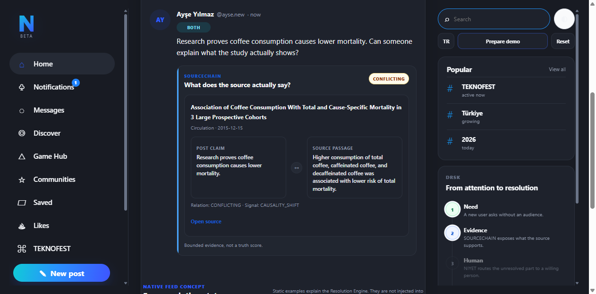
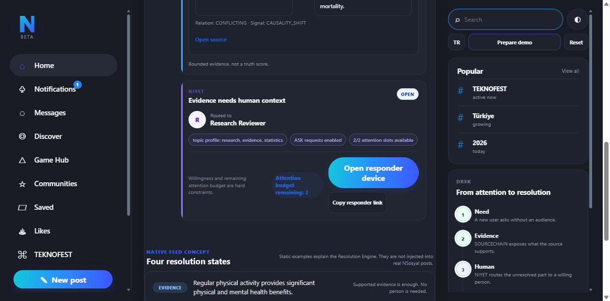
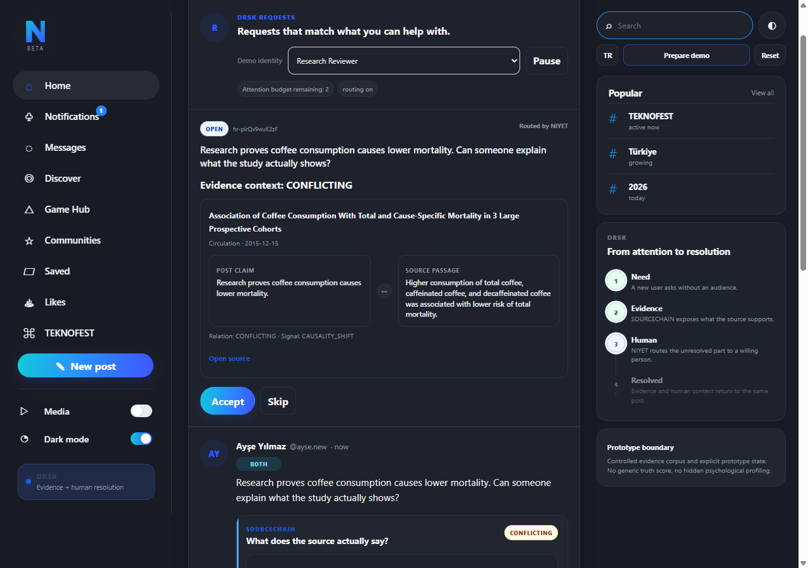
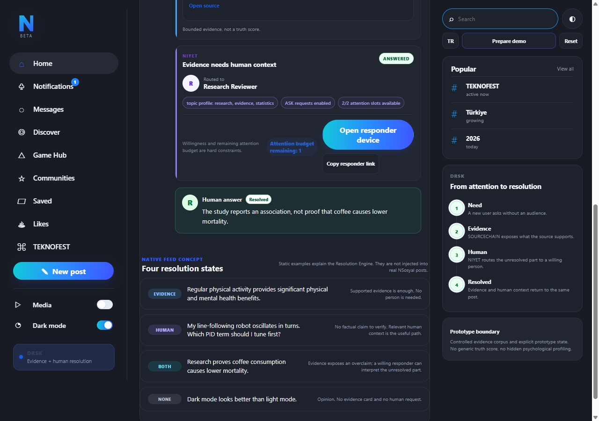
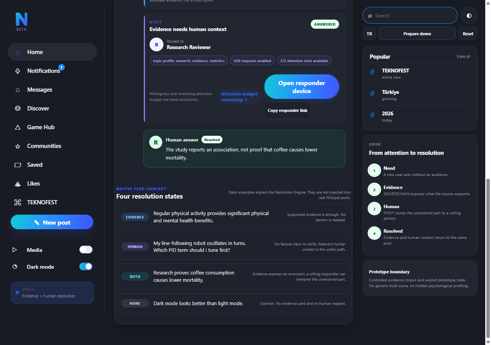

# DRSK — Hybrid Social Intelligence Layer

> **Evidence first. Human context by choice.**

DRSK is a resolution layer for social platforms. It does not force every post through the same AI pipeline. It decides what the post actually needs next: evidence, a person, both, or nothing.

**[Open the final live demo](https://niyet-nsosyal-git-fix-judge-ux-stabilization-teknofest-2026.vercel.app/live)** · [Architecture](docs/DRSK_ARCHITECTURE.md) · [Demo guide](docs/DRSK_DEMO.md) · [Engineering journey](docs/ENGINEERING_JOURNEY.md) · [NSosyal concept overlay](demo/nsosyal-overlay/README.md)

## Why DRSK exists

Social platforms already distribute content and attention extremely well. Two harder problems remain.

A real citation can still be used to tell the wrong story. A paper may say coffee consumption was **associated with** lower mortality while a post claims research **proves coffee causes** lower mortality.

At the same time, a useful question from a new or low-reach user may never reach the person who can actually help. The knowledge can already exist inside the community and still fail to meet the need.

DRSK treats both as resolution problems.

- **SOURCECHAIN** asks what the available evidence actually supports.
- **NIYET** asks whether human context is useful and, if so, which relevant, willing and available responder should receive the request.
- The **Resolution Engine** chooses the user-facing path.

| Path | Meaning |
| --- | --- |
| **EVIDENCE** | the factual need can be closed with bounded evidence |
| **HUMAN** | the useful answer is contextual, experiential or practical |
| **BOTH** | evidence exposes a gap or conflict and human interpretation can still add value |
| **NONE** | the post needs neither evidence nor human routing |

An internal deferred state is allowed when an evidence operation cannot be completed safely. Weak evidence is never promoted just to make the interface look complete.

## The interaction contract

A normal evidence check is private and repeatable.

~~~text
Check with DRSK
        |
        v
   inspect only
        |
        +--> EVIDENCE
        +--> HUMAN
        +--> BOTH
        +--> NONE
~~~

No responder capacity is consumed by a check.

Human routing is a separate explicit action:

~~~text
Ask a relevant person
        |
        v
      NIYET
        |
relevance + willingness
+ availability + capacity
        |
        v
     responder
        |
 Accept -> Answer
        |
        v
     Resolved
~~~

On the real NSosyal concept adapter, SOURCECHAIN can inspect a draft privately. Publication still happens through NSosyal's own control. The adapter waits until the exact text appears as a visible published post before human routing can be requested.

## What SOURCECHAIN shows

SOURCECHAIN keeps evidence acquisition separate from evidence interpretation.

For a checked factual claim it can preserve:

- exact claim text;
- exact source passage;
- source title, canonical URL and publication metadata;
- passage-level relation: `SUPPORTED`, `PARTIALLY_SUPPORTED`, `CONFLICTING` or `INSUFFICIENT`;
- typed wording shifts such as causality, certainty, quantity, scope, attribution and explicit temporal mismatch;
- provenance metadata used by the EvidenceBundle.

It does **not** emit a universal truth score. Missing evidence means insufficient evidence, not false.

### Evidence acquisition

The live pipeline is verified-first and fail-closed:

1. a strong match in the committed verified corpus is used as a fast deterministic path;
2. unseen claims can use Tavily basic search behind a quality gate;
3. Tavily advanced search is used only when the basic result is too weak;
4. Brave remains an optional secondary provider when configured;
5. the verified corpus is the final deterministic fallback.

Candidate web text is still processed by SOURCECHAIN's own passage ranking, relation and distortion logic. Search providers do not decide the verdict.

~~~text
TAVILY_API_KEY=...
BRAVE_SEARCH_API_KEY=...        # optional
~~~

## What NIYET does differently

NIYET is not a popularity recommender. Follower count is not an eligibility signal.

A responder must satisfy hard product constraints before allocation:

- topic relevance;
- explicit willingness for the request type;
- active / available state;
- remaining attention capacity.

Open requests can be allocated together under shared capacity instead of greedily locking the locally best responder one request at a time. Requests are allowed to remain unmatched when no eligible route clears the quality floor.

Responder controls include **Accept**, **Skip**, **Pause / Resume** and a finite attention budget. Accept consumes capacity exactly once and pins the request to the accepting responder.

## Working prototype

The final judge surface supports repeated arbitrary checks and a complete evidence-to-human round trip.

The same surface also makes the four product states visible in context:

### Final verified flow

~~~text
Prepare demo
-> Check with DRSK
-> SOURCECHAIN: CONFLICTING + CAUSALITY_SHIFT
-> Ask a relevant person
-> NIYET: Research Reviewer
-> Responder: Accept
-> Answer
-> Author: Resolved
~~~

The same-page Author/Responder switch and a separate responder-device link are both supported.

## Validation

The final stabilization pass completed with:

- **57 targeted tests passed** for the judge-facing flow;
- **283 full-suite tests passed**;
- JavaScript syntax checks passed for the live surface and extension;
- site build passed with **25 assets**;
- extension packaging passed;
- repeated private checks preserved responder capacity;
- GitHub Actions passed;
- the final Vercel Preview was Ready.

These software checks are separate from the project's model/development measurements.

### NIYET matching

Two team reviewers independently labeled the same 256 query-to-responder pairs.

- exact agreement: **243 / 256 = 94.92%**
- quadratic weighted Cohen's κ: **0.9756**

Frozen benchmark retrieval:

| Retriever | Precision@3 | Recall@3 | NDCG@3 |
| --- | ---: | ---: | ---: |
| weighted lexical TF-IDF | 0.4688 | 0.8438 | 0.8450 |
| ModernBERT-TR-Embed | **0.5417** | **0.9583** | **0.9025** |

At lexical similarity floor `0.02`, the bounded global allocator covered **78.12%** of reviewed requests versus **65.62%** for the capacity-aware greedy baseline. Total reviewed relevance increased from 45 to 52.

ModernBERT-TR-Embed is an **offline evaluation result**, not the lightweight deployed runtime.

### Response-needed classification

On controlled development data with grouped four-fold cross-validation:

- response-needed: accuracy `0.917 ± 0.030`, macro-F1 `0.915 ± 0.030`
- four-way intent: accuracy `0.885 ± 0.062`, macro-F1 `0.880 ± 0.061`

These are controlled-development measurements, not population estimates or claimed NSosyal production accuracy.

## Product surfaces

### `/live`

The judge-safe interactive surface. It supports arbitrary repeated checks, Author/Responder device views, the four resolution states, responder capacity and the complete Resolved lifecycle.

### NSosyal concept overlay

A Manifest V3 browser extension demonstrates how DRSK can sit over the real NSosyal composer without pretending to be an official NSosyal client.

The overlay reads composer text only after the user presses DRSK, never presses NSosyal publish/edit/delete controls, detects the exact published text before human routing, keeps routing opt-in, never forwards NSosyal cookies and preserves request state through guarded extension storage.

The adapter is a **concept integration**, not an official platform integration.

## Durable demo state

The human-help lifecycle is behind a small transactional `StateStore` boundary.

- `MemoryStateStore` is the explicit local/test fallback.
- `UpstashRedisStateStore` provides durable shared state when configured, using compare-and-set mutations, TTL and bounded retries.

~~~text
UPSTASH_REDIS_REST_URL=...
UPSTASH_REDIS_REST_TOKEN=...
DRSK_STATE_NAMESPACE=jury-demo-v2
DRSK_STATE_TTL_SECONDS=86400
~~~

Preview and production use separate default namespaces so verification does not spend the production jury session.

## Run locally

Python 3.11+ is required.

~~~bash
python -m pip install -c constraints.txt -e . pytest
pytest -q
python scripts/build_site.py
python scripts/package_nsosyal_overlay.py
python scripts/serve_local.py --port 8766
~~~

Reproduce the main development evaluations:

~~~bash
python experiments/evaluate_matching_draft.py
python experiments/evaluate_sourcechain_v0.py
python scripts/validate_annotations.py data/intent_seed_v1.csv
python scripts/validate_annotations.py data/response_gate_seed_v1.csv
python scripts/validate_sourcebench.py data/sourcebench_tr
~~~

## Repository map

| Path | Purpose |
| --- | --- |
| [`src/sourcechain/`](src/sourcechain/) | statement analysis, evidence acquisition, passage ranking, claim/evidence alignment and distortion checks |
| [`src/niyet/`](src/niyet/) | response/intent classification, responder retrieval, eligibility, scoring and capacity-aware allocation |
| [`src/drsk/`](src/drsk/) | Resolution Engine, SOURCECHAIN→NIYET adapter, human-help lifecycle and state boundary |
| [`api/`](api/) | bounded transport handlers and public state transitions |
| [`web/`](web/) | final bilingual judge surface and supporting web assets |
| [`demo/nsosyal-overlay/`](demo/nsosyal-overlay/) | scoped NSosyal concept adapter |
| [`data/`](data/) | controlled development sets, synthetic responder fixtures and reviewed benchmarks |
| [`experiments/`](experiments/) | reproducible retrieval, classification, allocation and SOURCECHAIN evaluation |
| [`tests/`](tests/) | unit, integration, regression and end-to-end contract tests |
| [`docs/`](docs/) | architecture, product, safety, datasets, demo and engineering history |

Start with the [documentation index](docs/README.md) for the evidence behind each public claim.

## Boundaries

- DRSK is not an official NSosyal integration.
- SOURCECHAIN is bounded evidence analysis, not universal web truth detection.
- Arbitrary reader-side injection under every existing NSosyal feed post is future native-integration scope.
- Synthetic responder profiles are prototype fixtures.
- Firebase is an isolated production-hardening track and is not required for the judge demo.
- ModernBERT-TR is evaluated offline and is not loaded into the lightweight runtime.
- SOURCEBENCH-TR is a small development regression set, not benchmark-grade proof.
- Live retrieval can miss good evidence; `INSUFFICIENT` is an intentional safe outcome.
- Production authentication, abuse controls and rate limiting remain separate hardening work.

The core design rule is simple: **show what the evidence supports, preserve uncertainty, and spend human attention only when it adds value.**
