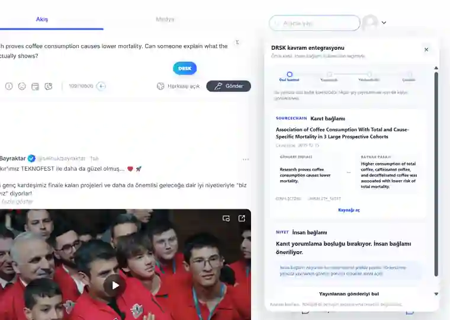
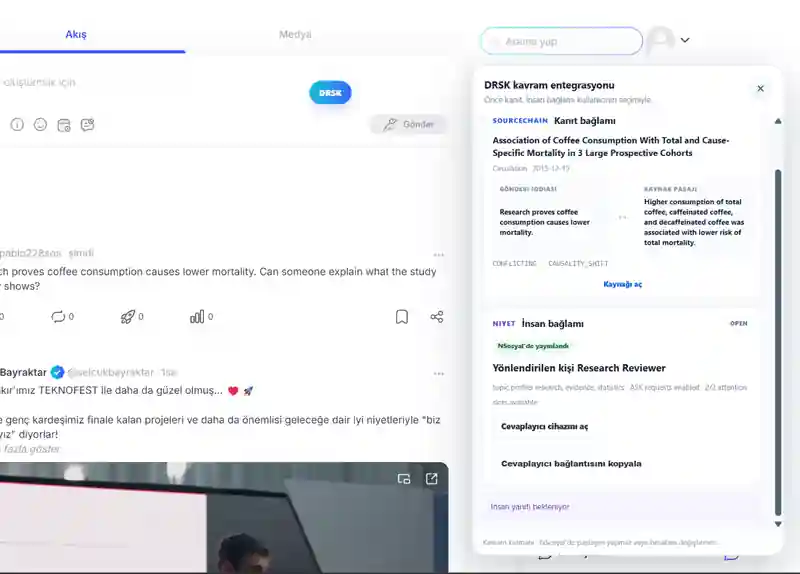

# Real NSosyal acceptance

**Authenticated hardware proof · 2026-09-19**

This page records the final authenticated host-DOM pass of the DRSK concept adapter on the real NSosyal interface. It is visual evidence of the tested integration lifecycle, not a claim of official NSosyal integration or production-wide compatibility.

## Observed lifecycle

```text
real NSosyal composer
-> private DRSK inspect
-> SOURCECHAIN evidence context
-> native NSosyal publish
-> exact published text detected
-> explicit Ask a relevant person
-> NIYET route
-> responder Accept
-> responder Answer
-> answer returned to the same DRSK state
```

The backend and resolution contracts are the same ones used by the deterministic [`/live`](https://niyet-nsosyal.vercel.app/live) surface.

## 1. Private evidence inspect

The author writes normally inside the real NSosyal composer and presses the small DRSK action. SOURCECHAIN can expose the claim-to-source relationship **before publication**.

At this point nothing has been published by DRSK and no human request has been created.



## 2. Native publication, then explicit opt-in

Publication remains under NSosyal's native control. The adapter waits until the exact inspected text appears as a visible, non-editable published post.

Only after that boundary is observed does the human action become available.


The important product contract is visible here: **Check is not Ask**. Evidence inspection does not silently spend another person's attention.

## 3. NIYET routes the unresolved need

After the user explicitly asks for human context, NIYET routes under the same relevance, willingness, availability and attention-capacity constraints used by the standalone prototype.

In the canonical coffee case, the request is assigned to the **Research Reviewer** fixture.



The prototype responder identities are synthetic fixtures. The routing, capacity and request lifecycle are real prototype behavior.

## 4. Human context returns to the same social need

The assigned responder can open the responder device, Accept, and Answer. The author-side overlay restores that request and shows the returned answer after the real NSosyal page lifecycle.


`ANSWERED` / `Resolved` means the selected resolution path completed. It does **not** mean a human response was converted into verified evidence.

## What this pass proves

- DRSK can be attached to the real authenticated NSosyal interface as a scoped Manifest V3 concept adapter.
- A private SOURCECHAIN inspect can happen without DRSK publishing content.
- DRSK does not press NSosyal publish, edit or delete controls.
- Human routing stays separate from evidence inspection and requires explicit user action.
- The adapter can detect the exact inspected text after native publication.
- The same evidence context can accompany the request into the responder flow.
- The responder can Accept and Answer through the shared DRSK backend lifecycle.
- The returned answer can be restored on the author-side real-host overlay.
- NSosyal account cookies are not forwarded to the DRSK backend.

The storage/persistence edge case found during this hardware pass was fixed in PR #34 and added to the regression suite. The canonical runtime acceptance snapshot is recorded in [Final acceptance](FINAL_ACCEPTANCE.md).

## What this pass does not claim

- This is **not** an official NSosyal integration.
- It does not claim compatibility with every future NSosyal DOM revision.
- It does not inject a reader-side DRSK action under every arbitrary foreign NSosyal feed post; that remains future native-integration scope.
- It does not turn human answers into truth labels.
- It does not replace production identity, reputation, moderation, abuse controls or rate limiting.
- Synthetic responder fixtures are not represented as real production experts.

## Reproduce the concept adapter

See the [NSosyal overlay README](../demo/nsosyal-overlay/README.md) and [install checklist](../demo/nsosyal-overlay/INSTALL.md).

For a host-independent full lifecycle, use the deterministic judge surface:

**https://niyet-nsosyal.vercel.app/live**

The core rule remains: **show what the evidence supports, preserve uncertainty, and spend human attention only when it adds value.**
